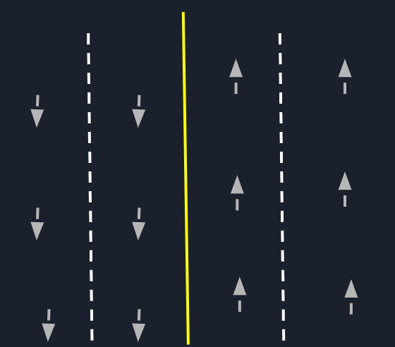
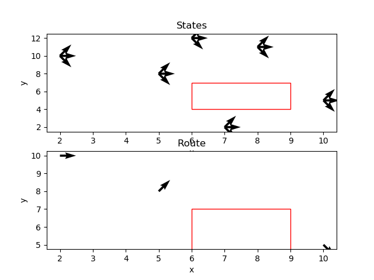

Robot Parallel Motion Planning
======================

**University of Pennsylvania, CIS 565: GPU Programming and Architecture, Final Project**

* Peyman Norouzi: [LinkedIn](https://www.linkedin.com/in/peymannorouzi)

* Klayton Wittler: [LinkedIn](https://www.linkedin.com/in/klayton-wittler)

Industrial road | Running from the cops 
:-------------------------:|:-------------------------:
| 

## Table of Content:

- [Overview](#overview)
  * [Parrallel Motion Planning on the GPU](#parrallel-motion-planning-on-the-gpu)
  * [CARLA](#carla)
- [GMT* Algorithm](#gmt-algorithm)
  * [Sampling Based Motion Planning](#sampling-based-motion-planning)
- [Implementation](#implementation)
  * [Enviroments](#enviroments)
  * [Pipeline](#pipeline)
  * [State Space Samples](#state-space-samples)
  * [Dubin's Model](#dubins-model)
  * [Collison Check](#collison-check)
  * [Debugging/Unit Testing](#debuggingunit-testing)
- [Performance Analysis](#performance-analysis)
  * [Bloopers](#bloopers)
- [Milestones](#milestones)
- [Credits/Sources](#creditssources)

## Overview:

Autonomous vehicles are a new sensation of the 21st-century economy. Many big/small companies are fiercely competing in their path of full driving autonomy. The goal of this project is to make use of the parallelization power of the GPU to create an autonomous robot (vehicle) capable of reaching a defined goal while navigating in an unknown enviroment.

An autonomous vehicle needs to be able to do the following 4: 

**1. Identify:**

An autonomous vehicle needs to be able to comprehend its surroundings and identify objects that may affect its decision making. Identification is usually done using the car's perception/vision system. The perception system usually consists of a combination of RGB cameras, Lidar and Radar.

**2. Predict:**

Now that the vehicle knows about objects surrounding it, it needs to predict surroundings behavior over a short and long time so the vehicle can appropriately behave in various scenarios. For example, If a car is moving on the lane next to it is moving at 30 MPH, the vehicle should be able to predict what the car is going to do in the next 5 seconds. 

**3. Decide:**

With the current knowledge of the surroundings and the desired destination, the car then needs to decide on how to move (motion planning) to reach the desired goal safely and efficiently.

**4. Execute:**

When a decision is made by the car's computer system, the car needs to be able to appropriately execute the plan in the environment that it is in using its engine wheel and transmission system

This project is mainly focused on number **3. Decide**. We implemented GMT* motion planning algorithm on the GPU and tested its effectiveness in various unknown environments in CARLA car simulator.

### Parrallel Motion Planning on the GPU:

Motion planning algorithms are meant to help an autonomous robot to find a sequence of valid configurations that moves it from the source to the desired destination. Due to the sequential nature of the task, many different sequential algorithms can successfully achieve this in various scenarios. One example of such an algorithm is [FMT*(Fast Marching Tree)](https://arxiv.org/pdf/1306.3532.pdf). Although FMT* works great for high dimensional state space, due to its sequential nature it is not able to be run on the GPU. For the algorithm to be able to be run on the GPU, we need to alter the algorithm to be able to run in parallel at some abstract level. This where [GMT* (Group Marching Tree)](https://arxiv.org/abs/1705.02403) paper comes into play. Brian Itcher et al proposed a variation to the FMT* that would allow it to run on the GPU. We implemented the algorithm on the GPU and tested our result on CARLA driving simulator. We will discuss the algorithm in more detail later in the read me!

### CARLA:

Our testing environment for this project is [CARLA driving simulator](http://carla.org/), which is an open-source development, training, and validation environment for autonomous driving systems. CARLA is built on top of UE4 and has a python client API that allows us to engage with a car and driving environment. We decided to go with CARLA due to time and financial resources (check our bloopers :D) that an actual robot would have taken from us to complete this project.

### Build:

To be able to run our code, ...

## GMT* Algorithm:

### Sampling Based Motion Planning

## Implementation:

In this section we go through our implementation that allows our virtual [Tesla Model 3](https://twitter.com/elonmusk?ref_src=twsrc%5Egoogle%7Ctwcamp%5Eserp%7Ctwgr%5Eauthor) drive around the city so smoothly!

### Pipeline:

## Enviroments:

### State Space Samples

CARALA state samples | Up sample orientation 
:-------------------------:|:-------------------------:
| 

### Dubin's Model

Dubin's Model | Example 
:-------------------------:|:-------------------------:
| 

### Collison Check:

### Debugging/Unit Testing:

Unit Test 1 | Unit Test 2 | Unit Test 3 
:-------------------------:|:-------------------------:|:-------------------------:
| |  

## Performance Analysis:

### Bloopers:

## Milestones:

* [Pitch](files/CIS565_finalProject-pitch.pdf)
* [Milestone 1](files/CIS565_RPMP-milestone1.pdf)
* [Milestone 2](files/CIS565_RPMP-milestone2.pdf)
* [Milestone 3](files/CIS565_RPMP-milestone3.pdf)

## Credits/Sources:

FMT: https://arxiv.org/pdf/1306.3532.pdf
GMT: https://arxiv.org/abs/1705.02403
CARLA: http://carla.org/

