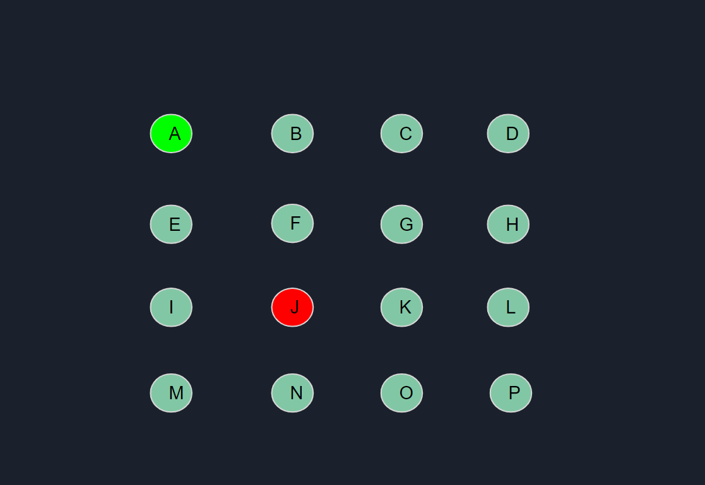
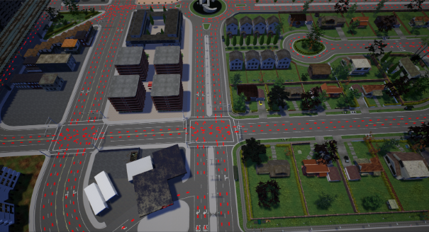
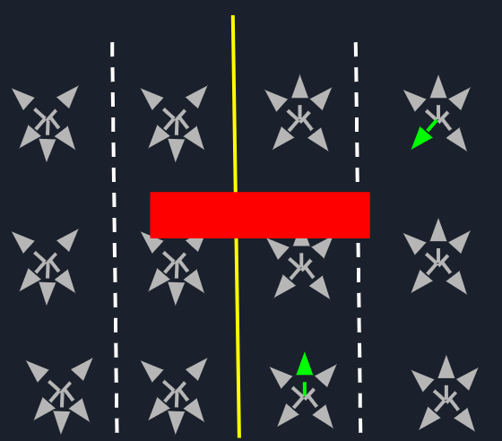

Robot Parallel Motion Planning
======================

**University of Pennsylvania, CIS 565: GPU Programming and Architecture, Final Project**

* Peyman Norouzi: [LinkedIn](https://www.linkedin.com/in/peymannorouzi)

* Klayton Wittler: [LinkedIn](https://www.linkedin.com/in/klayton-wittler)

Industrial road | Running from the cops 
:-------------------------:|:-------------------------:
| 

## Table of Content:

- [Overview](#overview)
  * [Parrallel Motion Planning on the GPU](#parrallel-motion-planning-on-the-gpu)
  * [CARLA](#carla)
- [GMT* Algorithm](#gmt-algorithm)
  * [Sampling Based Motion Planning](#sampling-based-motion-planning)
- [Implementation](#implementation)
  * [Enviroments](#enviroments)
  * [Pipeline](#pipeline)
  * [State Space Samples](#state-space-samples)
  * [Dubin's Model](#dubins-model)
  * [Collison Check](#collison-check)
  * [Debugging/Unit Testing](#debuggingunit-testing)
- [Performance Analysis](#performance-analysis)
  * [Bloopers](#bloopers)
- [Milestones](#milestones)
- [Credits/Sources](#creditssources)

## Overview:

Autonomous vehicles are a new sensation of the 21st-century economy. Many big/small companies are fiercely competing in their path of full driving autonomy. The goal of this project is to make use of the parallelization power of the GPU to create an autonomous robot (vehicle) capable of reaching a defined goal while navigating in an unknown enviroment.

An autonomous vehicle needs to be able to do the following 4: 

1. Identify:

An autonomous vehicle needs to be able to comprehend its surroundings and identify objects that may affect its decision making. Identification is usually done using the car's perception/vision system. The perception system usually consists of a combination of RGB cameras, Lidar and Radar.

2. Predict:

Now that the vehicle knows about objects surrounding it, it needs to predict surroundings behavior over a short and long time so the vehicle can appropriately behave in various scenarios. For example, If a car is moving on the lane next to it is moving at 30 MPH, the vehicle should be able to predict what the car is going to do in the next 5 seconds. 

**3. Decide**:

With the current knowledge of the surroundings and the desired destination, the car then needs to decide on how to move (motion planning) to reach the desired goal safely and efficiently.

4. Execute:

When a decision is made by the car's computer system, the car needs to be able to appropriately execute the plan in the environment that it is in using its engine wheel and transmission system

This project is mainly focused on number **3. Decide**. We implemented GMT* motion planning algorithm on the GPU and tested its effectiveness in various unknown environments in CARLA car simulator.

### Parrallel Motion Planning on the GPU:

The power of the GPU can be used 

### CARLA:

We are going to be using 

## GMT* Algorithm:

### Sampling Based Motion Planning

## Implementation:

## Enviroments:

### Pipeline

### State Space Samples

CARALA state samples | Up sample orientation 
:-------------------------:|:-------------------------:
| 

### Dubin's Model

Dubin's Model | Example 
:-------------------------:|:-------------------------:
| 

### Collison Check:

### Debugging/Unit Testing:

Unit Test 1 | Unit Test 2 | Unit Test 3 
:-------------------------:|:-------------------------:|:-------------------------:
| |  

## Performance Analysis:

### Bloopers:

## Milestones:

* [Pitch](files/CIS565_finalProject-pitch.pdf)
* [Milestone 1](files/CIS565_RPMP-milestone1.pdf)
* [Milestone 2](files/CIS565_RPMP-milestone2.pdf)
* [Milestone 3](files/CIS565_RPMP-milestone3.pdf)

## Credits/Sources:

